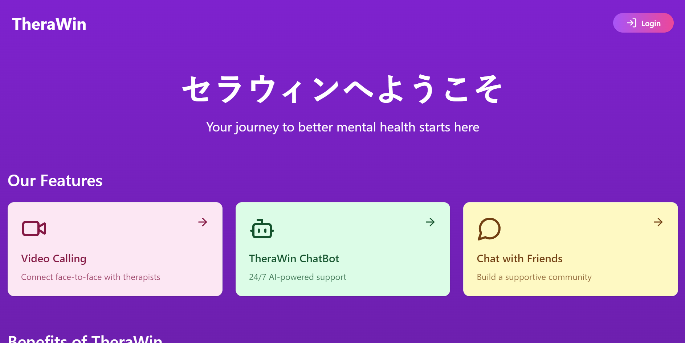
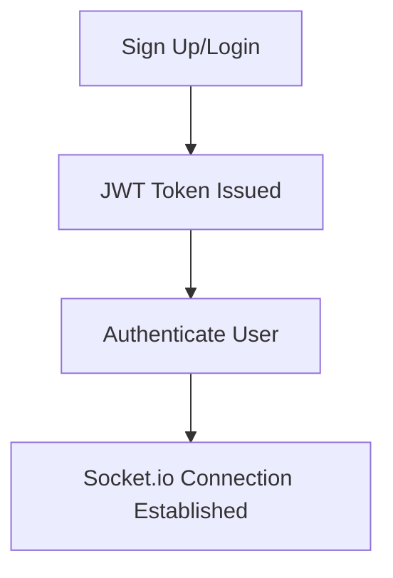
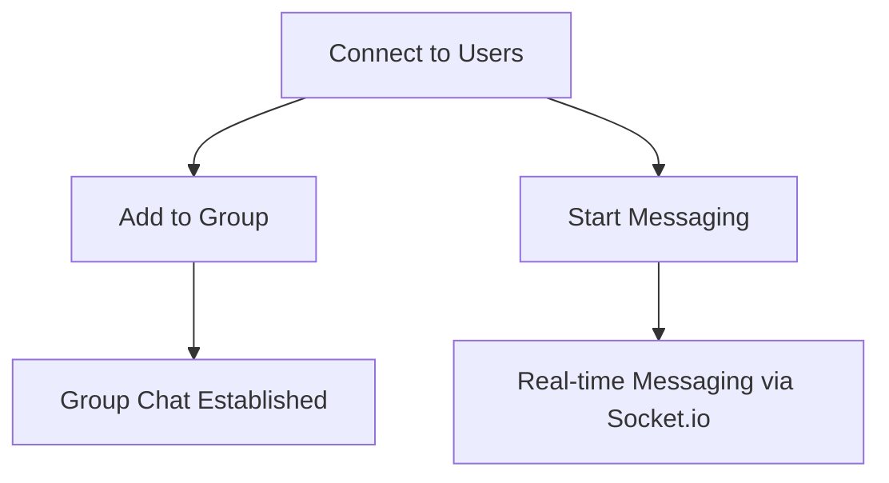
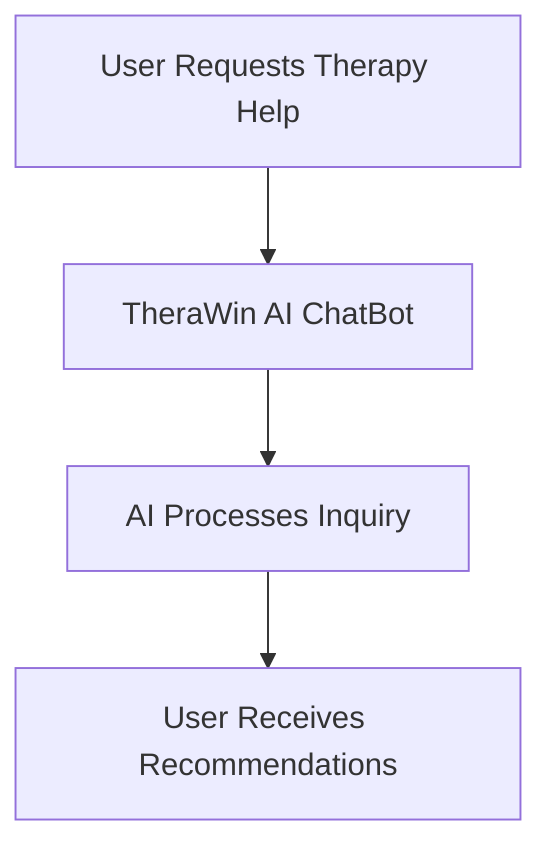
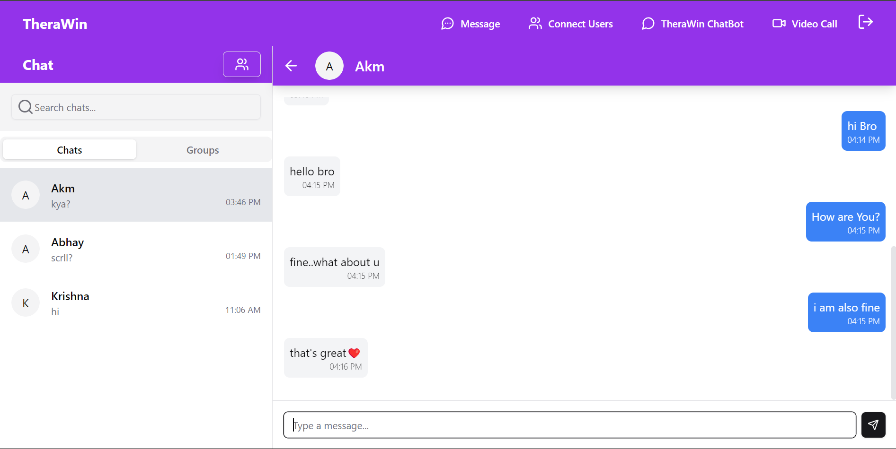
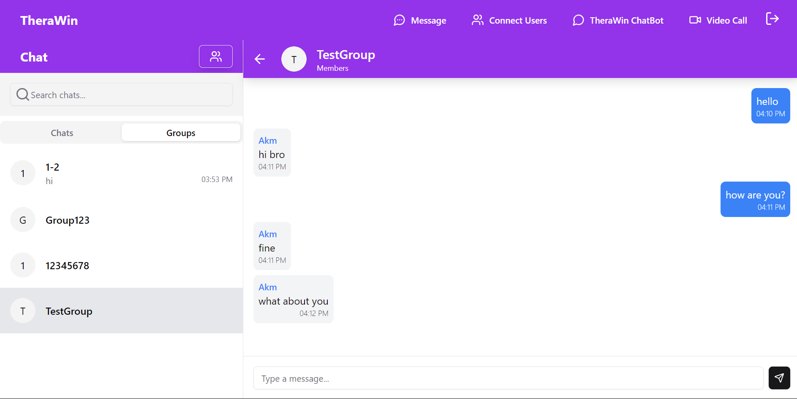
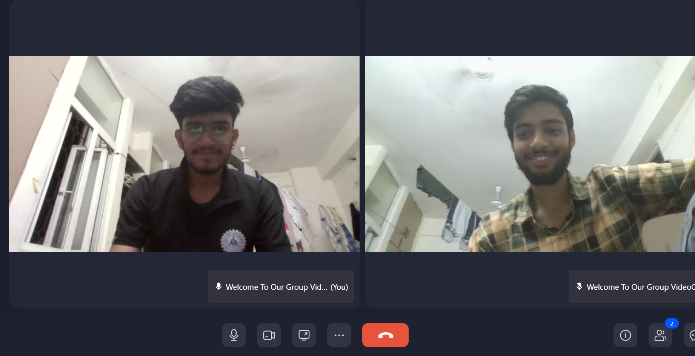
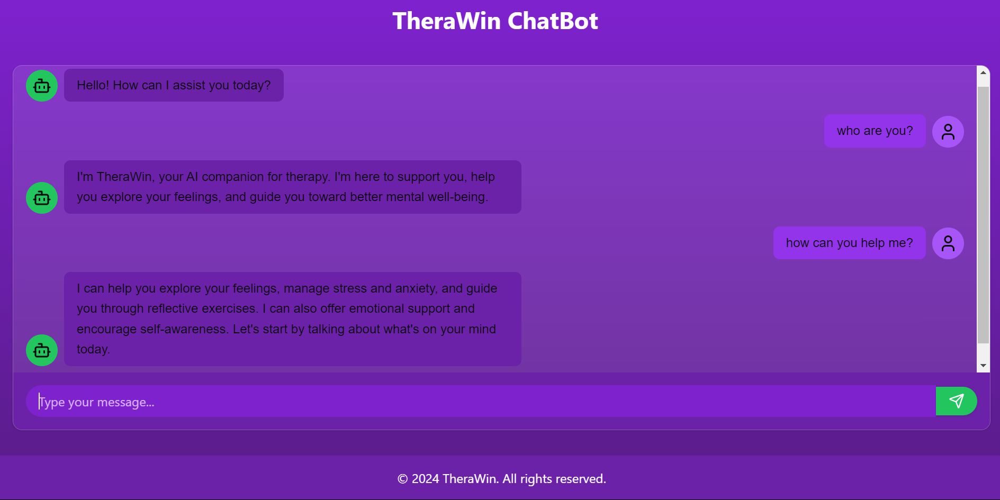
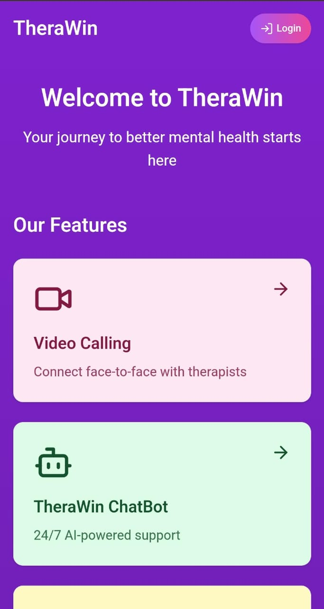
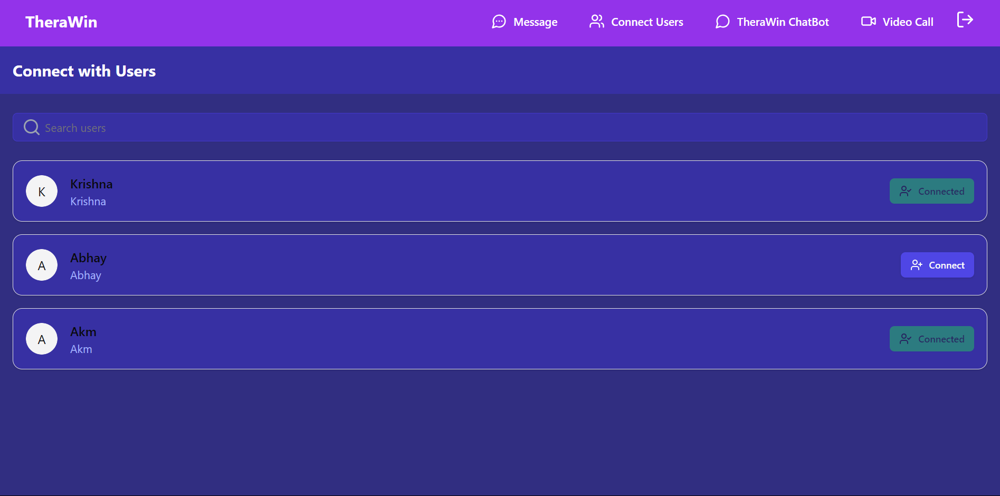

# 💬 **Real-time Chat Application**



**Live Demo**: [Explore the App Here](https://unrivaled-melba-047ef2.netlify.app/)  
⚠️ *Backend deployed on Render (free tier, may take a few seconds to load)*

---

## 🚀 **Overview**
Welcome to the **Real-time Chat Application**—an interactive chat platform that allows users to connect, message, create groups, video call, and even seek therapy assistance via **TheraWin AI ChatBot**. This app is perfect for individuals and groups who value seamless communication with advanced features.

---

## 🌟 **Key Features**

- **Real-time Messaging**: Chat instantly with friends, powered by **Socket.io**.
- **Group Chats**: Create and manage groups effortlessly.
- **TheraWin AI ChatBot**: Get therapy assistance directly from our AI-powered chatbot.
- **Video Calls**: Face-to-face conversations using the built-in **ZEGOCLOUD** video call feature.
- **Modern UI**: Experience elegant design and fluid animations with **Framer Motion** and **ShadCN UI**.
- **Secure**: Robust authentication with **JWT**.

---

## 🔧 **Tech Stack**

| **Technology** | **Usage** |
| -------------- | --------- |
| **Frontend**   | Next.js, Framer Motion, ShadCN UI |
| **Backend**    | Node.js, Express.js, Socket.io |
| **Database**   | MongoDB |
| **Auth**       | JWT (JSON Web Tokens) |
| **Deployment** | Frontend on Netlify, Backend on Render |

---

## 🛠 **Architecture & Workflows**

### 🔐 **User Authentication Flow**


- **Step 1**: Users log in or register.
- **Step 2**: JWT tokens secure the session.
- **Step 3**: Users are connected to the real-time server via **Socket.io**.

---

### 🔗 **Connection & Messaging Flow**


- **Step 1**: Connect to other users from the connection page.
- **Step 2**: Initiate private messages or add users to groups.
- **Step 3**: Real-time chats are powered by **Socket.io**.

---

### 🤖 **TheraWin ChatBot**


- **TheraWin ChatBot** provides AI-driven responses to therapy-related queries.

---

- Users can start video calls within the app using **ZEGOCLOUD** technology.

---

## 🖥️ **Screenshots**

- **Chat Interface**  
  

- **Group Chat Interface**  
  

- **Video Call Interface**  
  

- **AiChat Bot Interface**  
  


- **Small Screen Interface**  
  

- **Connection Interface**  
  

---


## Chat Backend

This repository contains the backend code for the chat application.

- **Repository Link:** [Chat Backend](https://github.com/anishiit/chat-backend)

## ZEOGOCLOUD

This repository contains the UI kits and group setup for ZEOGOCLOUD using Next.js.

- **Repository Link:** [ZEOGOCLOUD](https://github.com/anishiit/nextjs-zegocloud-uikits-groul)


## 🏃‍♂️ **Getting Started**

### 1. Clone the repositories:
```bash
git clone https://github.com/anishiit/chat-backend
git clone https://github.com/anishiit/chat-frontend
```

### 2. Install dependencies:
```bash
cd chat-backend && npm install
cd ../chat-frontend && npm install
```

### 3. Start the servers:
```bash
cd chat-backend && npm start
cd ../chat-frontend && npm start
```

---

## 🛠 **Contribution**

We welcome contributions! Feel free to submit pull requests or report issues. Make sure to check out the [contribution guidelines](https://github.com/anishiit/chat-backend/blob/main/CODE_OF_CONDUCT.md).

---
